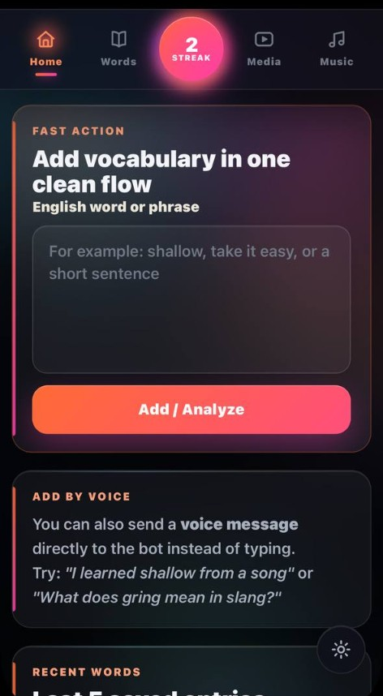
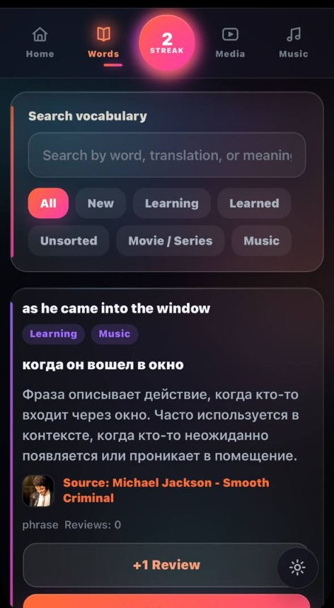
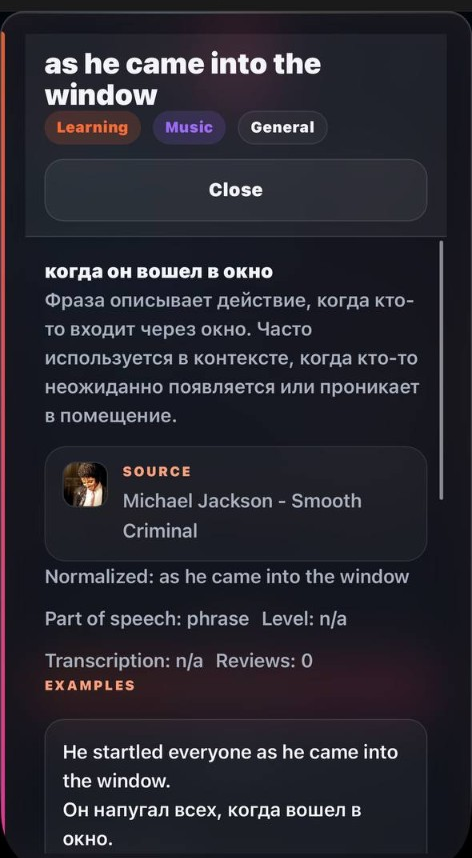
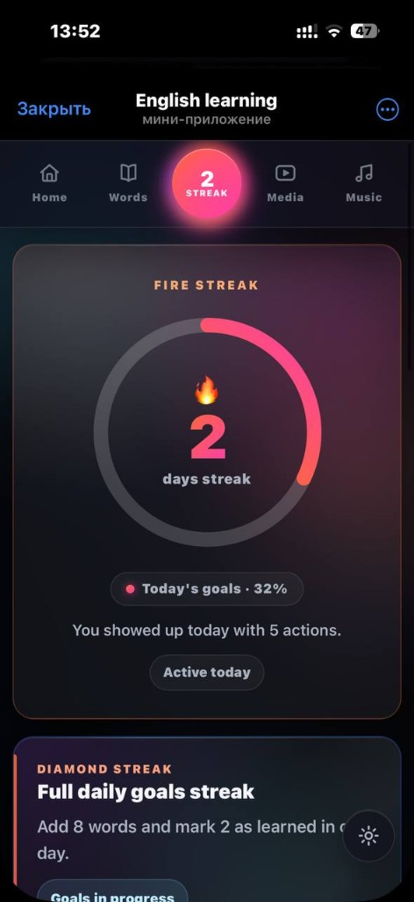
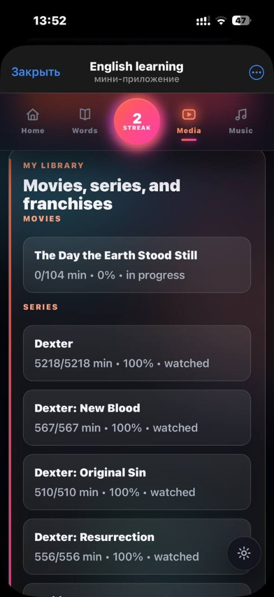
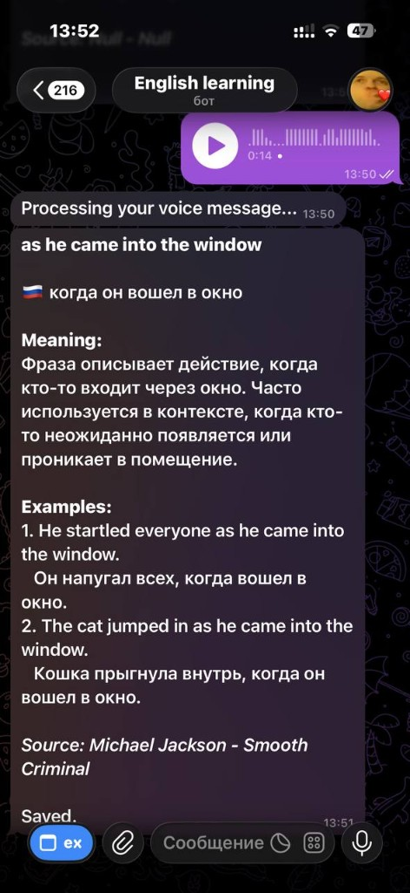
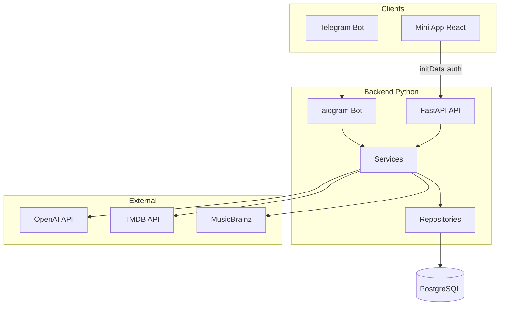

# English Vocabulary — Telegram Mini App

Personal English vocabulary notebook powered by **Telegram Bot**, **Mini App**, **OpenAI**, and **PostgreSQL**.  
Send a word to the bot or add it in the app — get a structured learning card, track progress, link words to movies/music, and keep a daily streak.

> Portfolio project · not a public SaaS · built for learning and demo


---

## Screenshots

<p align="center"><sub>Mini App · Telegram bot · dark theme · mobile-first UI</sub></p>

<table align="center">
  <tr>
    <td align="center" width="50%">
      
      <br /><br />
      <strong>Home</strong>
      <br /><sub>Quick add flow · recent words · voice hint</sub>
    </td>
    <td align="center" width="50%">
      
      <br /><br />
      <strong>Vocabulary</strong>
      <br /><sub>Search · status filters · media tags</sub>
    </td>
  </tr>
  <tr>
    <td align="center">
      
      <br /><br />
      <strong>Word card</strong>
      <br /><sub>Full-screen modal · translation · examples · Ask AI</sub>
    </td>
    <td align="center">
      
      <br /><br />
      <strong>Streak</strong>
      <br /><sub>Daily goals · progress ring · activity</sub>
    </td>
  </tr>
  <tr>
    <td align="center">
      
      <br /><br />
      <strong>Media library</strong>
      <br /><sub>Movies & series · watch progress · TMDB</sub>
    </td>
    <td align="center">
      
      <br /><br />
      <strong>Telegram bot</strong>
      <br /><sub>Text or voice → structured learning card</sub>
    </td>
  </tr>
</table>

---

## Highlights

| Area | What stands out |
|------|-----------------|
| **Architecture** | Layered backend: routes → services → repositories. Bot and API share business logic. |
| **Security** | Telegram Mini App `initData` HMAC validation; no trusting client `tg_user_id` in production. |
| **UX** | Mobile-first UI, GSAP motion, dark/light theme, full-screen word detail modal. |
| **Ops** | Docker Compose locally, Railway deploy with auto-migrations, DB healthcheck. |
| **Quality** | Alembic migrations, typed Python/TS, pytest suite, GitHub Actions CI. |

---

## Features

### Core vocabulary
- Add words via **Telegram bot** (text + voice) or **Mini App**
- OpenAI structured cards: translation, meaning, examples, synonyms, CEFR level
- Analysis modes: general / slang / conversation
- Search, status (`new` → `learning` → `learned`), delete, AI follow-up questions

### Learning & motivation
- Daily **streak** with goals and activity calendar
- AI vocabulary suggestions for the day
- Custom AI instructions per user

### Media & music context
- Link words to **TMDB** movies/series (library, seasons, episodes, progress)
- Link words to **MusicBrainz** tracks
- Media-scoped vocabulary views

---

## Architecture



**Request flow (Mini App):** client sends `X-Telegram-Init-Data` → backend validates HMAC with bot token → `tg_user_id` derived server-side → service layer → PostgreSQL.

---

## Tech stack

| Layer | Technologies |
|-------|--------------|
| Backend | Python 3.11, FastAPI, aiogram 3, SQLAlchemy 2 async, Alembic, httpx |
| Frontend | React 18, TypeScript, Vite, GSAP, Framer Motion |
| Data | PostgreSQL 16 |
| AI | OpenAI (`gpt-4o-mini`, Whisper for voice) |
| Infra | Docker Compose, Railway |

---

## Quick start (local)

```bash
cp .env.example .env
# Set TG_BOT_TOKEN and OPENAI_API_KEY

docker compose up --build
docker compose exec backend-api alembic upgrade head
```

| Service | URL |
|---------|-----|
| API | http://localhost:8000 |
| API health | http://localhost:8000/api/v1/health |
| Mini App (dev) | http://localhost:5173 |
| Postgres (host) | localhost:`HOST_DB_PORT` from `.env` |

Local Mini App uses dev auth bypass (`ALLOW_DEV_AUTH_BYPASS=true` in `.env.example`).

---

## Deploy (Railway)

Production setup: [`docs/RAILWAY.md`](docs/RAILWAY.md)

Summary:
- **4 services:** Postgres, `api`, `bot`, `frontend`
- Migrations run automatically on API start (`alembic upgrade head`)
- Set `APP_ENV=production`, `ALLOW_DEV_AUTH_BYPASS=false`, matching `CORS_ORIGINS` / `WEBAPP_URL`

---

## Project structure

```text
backend/app/
  api/v1/          # REST routes + Telegram auth deps
  bot/             # aiogram handlers, voice, capture flow
  core/            # config, logging, telegram_auth, rate limit
  services/        # business logic, OpenAI, media, streak
  repositories/    # database access
  models/          # SQLAlchemy models
  schemas/         # Pydantic v2
frontend/src/
  api/             # typed API client + initData headers
  components/      # UI building blocks
  pages/           # tab screens
  hooks/           # GSAP, scroll lock
```

---

## Tests & CI

```bash
# from repo root, with venv + .env loaded
pytest backend/tests -q
cd frontend && npm run build
```

GitHub Actions runs backend tests and frontend build on push (see [`.github/workflows/ci.yml`](.github/workflows/ci.yml)).

---

## Environment

All variables: [`.env.example`](.env.example)

Required secrets:
- `TG_BOT_TOKEN` — [@BotFather](https://t.me/BotFather)
- `OPENAI_API_KEY` — [OpenAI platform](https://platform.openai.com/)

Optional: `TMDB_API_KEY` for media search.

---

## License

Personal portfolio project. All rights reserved unless stated otherwise.
